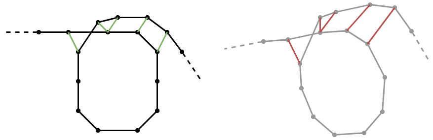

.. Copyright 2018 The Cartographer Authors

.. Licensed under the Apache License, Version 2.0 (the "License");
   you may not use this file except in compliance with the License.
   You may obtain a copy of the License at

..      http://www.apache.org/licenses/LICENSE-2.0

.. Unless required by applicable law or agreed to in writing, software
   distributed under the License is distributed on an "AS IS" BASIS,
   WITHOUT WARRANTIES OR CONDITIONS OF ANY KIND, either express or implied.
   See the License for the specific language governing permissions and
   limitations under the License.

==========
Evaluation
==========

Performing evaluation is a crucial part of developing a SLAM system. 
For this purpose, Cartographer offers built-in tools that can aid the tuning process or can be used for quality assurance purposes.

These tools can be used to assess the SLAM result even when no dedicated ground truth is available.
This is in contrast to public SLAM benchmarks like e.g the KITTI dataset [1]_ or the TUM RGB-D dataset [2]_, where highly-precise ground truth states (GPS-RTK, motion capture) are available as a reference.

Concept
=======

The process comprises two steps:

1. auto-generation of "ground truth" relations
2. evaluation of the test data against the generated ground truth

The evaluation is based on the pose relations metric proposed in [3]_. 
Rather than comparing the pose of a trajectory node directly to the corresponding ground truth pose, it compares the relative poses between two trajectory nodes in the probe data to the corresponding relation of two trajectory nodes in the ground truth trajectory.

In Cartographer, we can generate such ground truth relations from trajectories with loop closures.
Let an optimized trajectory with loop closures be the input for the ground truth generation.
We select the relations from loop closure constraints that satisfy the following criteria:

* ``min_covered_distance``: Minimum covered distance in meters before a loop closure is considered a candidate for autogenerated ground truth.
* ``outlier_threshold_meters``: Distance in meters beyond which constraints are considered outliers.
* ``outlier_threshold_radians``: Distance in radians beyond which constraints are considered outliers.

We can assume the pose relations of neighboring trajectory nodes fulfilling these requirements to be locally correct in a fully optimized trajectory.
Although this is not a ground truth in the sense of an independent input from another source, we can now use it to evaluate the quality of local SLAM results that were generated without loop closure optimization.

The following figure illustrates the concept. 
On the left side, the ground truth relations are visualized as green connections between trajectory nodes of a fully optimized trajectory.
On the right side, the corresponding relations in a non-optimized trajectory are shown in red.

The actual metric that is computed is the difference between the ground truth (green) and the probe (red) relations.

.. editable version: https://drive.google.com/file/d/1riJCj8KK4tQZArssGRtoXt7aBr1SWEXM/view?usp=sharing

Advantages & Limitations
========================

The first obvious advantage is the easier data collection process compared to a cumbersome ground truth setup. 
Another great advantage of this methodology is that the SLAM system can be evaluated in any custom sensor configuration (compared to public benchmarks where we are restricted to the data and the sensor configuration of the authors).

However, this type of self-evaluation is not suitable for measuring the accuracy of the full SLAM system with all optimizations enabled - only an evaluation with *real* ground truth states can provide that. 
Furthermore, trajectory nodes outside of loop closure areas can't be considered.

How-To
======

Given a serialized state of a fully optimized trajectory (here: ``optimized.pbstream`` file), the ground truth relations can be generated with the following command:

.. code-block:: bash
  
  cd <build>  # (directory where Cartographer's binaries are located)
  ./cartographer_autogenerate_ground_truth -pose_graph_filename optimized.pbstream -output_filename relations.pbstream -min_covered_distance 100 -outlier_threshold_meters 0.15 -outlier_threshold_radians 0.02

Then, a non-optimized trajectory ``test.pbstream`` can be evaluated against the generated relations with:

.. code-block:: bash

  ./cartographer_compute_relations_metrics -relations_filename relations.pbstream -pose_graph_filename test.pbstream

This will produce output in this form:

.. code-block:: none

  Abs translational error 0.01944 +/- 0.01819 m
  Sqr translational error 0.00071 +/- 0.00189 m^2
  Abs rotational error 0.11197 +/- 0.12432 deg
  Sqr rotational error 0.02799 +/- 0.07604 deg^2

----

References
==========

.. [1] Andreas Geiger, Philip Lenz and Raquel Urtasun. 
      *Are we ready for Autonomous Driving? The KITTI Vision Benchmark Suite*.
      CVPR, 2012.
.. [2] Jürgen Sturm, Nikolas Engelhard, Felix Endres, Wolfram Burgard and Daniel Cremers.
      *A Benchmark for the Evaluation of RGB-D SLAM Systems*.
      IROS, 2012.
.. [3] Rainer Kümmerle, Bastian Steder, Christian Dornhege, Michael Ruhnke, Giorgio Grisetti, Cyrill Stachniss and Alexander Kleiner.
      *On measuring the accuracy of SLAM algorithms.*
      Autonomous Robots 27(4), pp.387-407, 2009.
