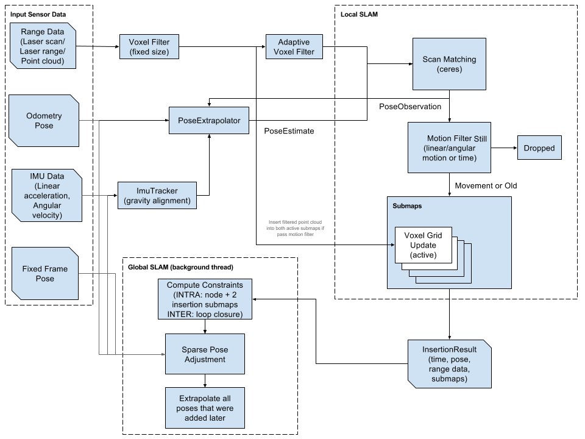

.. Copyright 2016 The Cartographer Authors

.. Licensed under the Apache License, Version 2.0 (the "License");
   you may not use this file except in compliance with the License.
   You may obtain a copy of the License at

..      http://www.apache.org/licenses/LICENSE-2.0

.. Unless required by applicable law or agreed to in writing, software
   distributed under the License is distributed on an "AS IS" BASIS,
   WITHOUT WARRANTIES OR CONDITIONS OF ANY KIND, either express or implied.
   See the License for the specific language governing permissions and
   limitations under the License.

============
Cartographer
============

.. toctree::
   :maxdepth: 2
   :hidden:

   configuration
   evaluation
   terminology
   cost_functions
   pbstream_migration

`Cartographer`_ is a system that provides real-time simultaneous localization
and mapping (`SLAM`_) in 2D and 3D across multiple platforms and sensor
configurations.

.. _Cartographer: https://github.com/googlecartographer/cartographer
.. _SLAM: https://en.wikipedia.org/wiki/Simultaneous_localization_and_mapping

Technical Overview
==================
* High level system overview of Cartographer

.. To make modifications, edit the original Google Sketch and export a png.
.. https://docs.google.com/drawings/d/1kCJ_dEbSvV83THCUfMikCPw7xFrTkrvRw5r6Ji8C90c/edit?usp=sharing

Getting started
===============

Cartographer is a standalone C++ library. To get started quickly, use our `ROS
<http://www.ros.org>`_ integration.

Getting started with ROS
------------------------

ROS integration is provided by the `Cartographer ROS repository`_. You will find
complete documentation for using Cartographer with ROS at the
`Cartographer ROS Read the Docs site`_.

.. _Cartographer ROS repository: https://github.com/googlecartographer/cartographer_ros
.. _Cartographer ROS Read the Docs site: https://google-cartographer-ros.readthedocs.io

Getting started without ROS
---------------------------

Please see our ROS integration as a starting point for integrating your system
with the standalone library. Currently, it is the best available reference.

On Ubuntu 14.04 (Trusty):

.. literalinclude:: ../../scripts/install_debs_cmake.sh
  :language: bash
  :lines: 20-

.. literalinclude:: ../../scripts/install_ceres.sh
  :language: bash
  :lines: 20-

.. literalinclude:: ../../scripts/install_proto3.sh
  :language: bash
  :lines: 20-

.. literalinclude:: ../../scripts/install_cartographer_cmake.sh
  :language: bash
  :lines: 20-

.. _system-requirements:

System Requirements
===================

Although Cartographer may run on other systems, it is confirmed to be working
on systems that meet the following requirements:

* 64-bit, modern CPU (e.g. 3rd generation i7)
* 16 GB RAM
* Ubuntu 14.04 (Trusty) and 16.04 (Xenial)
* gcc version 4.8.4 and 5.4.0

Known Issues
------------

* 32-bit builds have libeigen alignment problems which cause crashes and/or
  memory corruptions.

How to cite us
==============

Background about the algorithms developed for Cartographer can be found in the
following publication. If you use Cartographer for your research, we would
appreciate it if you cite our paper.

W. Hess, D. Kohler, H. Rapp, and D. Andor,
`Real-Time Loop Closure in 2D LIDAR SLAM`_, in
*Robotics and Automation (ICRA), 2016 IEEE International Conference on*.
IEEE, 2016. pp. 1271–1278.

.. _Real-Time Loop Closure in 2D LIDAR SLAM: https://research.google.com/pubs/pub45466.html
